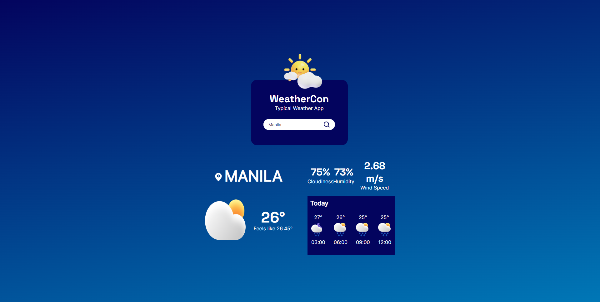

# Weather App

This is a solution to the [Project: Weather App](https://www.theodinproject.com/lessons/node-path-javascript-weather-app). The [Odin Project](https://www.theodinproject.com/about) provides a free open source coding curriculum that can be taken entirely online. Since its inception, it has helped many students get hired as developers and has assisted countless others in learning enough programming to work on their own personal projects.

## Overview

### The challenge

Build a simple Weather Application that:

- gets data from the API
- displays data from the API

### Screenshot

### Links

- Live Site URL: [https://theadg.github.io/weather-app/]

## My Process

### Built with

- HTML5
- CSS custom properties
- BEM Naming Convention
- Vanilla JS
- SASS
- Flexbox
- Grid
- Animate.CSS
- Data fns

### What I learned

By developing this project, I have learned and have gotten the idea of how Asynchronous JavaScript and APIs work . There are many ways how to handle Asynchronous Operations in JS namely: Callbacks, promises, and Async/Await. With this project, I used promises with async/await. These topics were foreign to me before but it turns out they aren't as complicated as I thought they would be. I feel like a better developer by understanding these core principles of web development.

### Continued development

I will work on more projects that involve Async JS and the use of APIs for me to really get the hang of it. I'll keep writing simple, readable, and understandable code by using es-lint. With the knowledge I have gotten from the project, I think I'll be able to create more and more interactive and dynamic SPAs and websites.
